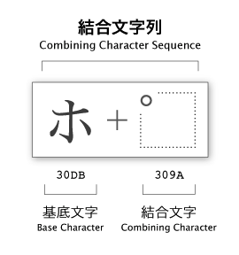

# textlint-rule-no-nfd [](https://travis-ci.org/textlint-ja/textlint-rule-no-nfd) [](https://textlint.github.io/) 

[textlint](https://textlint.github.io/ "textlint") rule that disallow to use NFD like UTF8-MAC 濁点.

> ホ゜ケット
> エンシ゛ン

といったMac OS XでPDFやFinderからのコピペで問題となる濁点を見つけて、修正する[textlint](https://textlint.github.io/ "textlint")ルールです。

## Install

Install with [npm](https://www.npmjs.com/):

    npm install textlint-rule-no-nfd

## Usage

Via `.textlintrc`(Recommended)


```json
{
    "rules": {
        "no-nfd": true
    }
}
```

Via CLI

```
textlint --rule no-nfd README.md
```

## Fixable

[](https://textlint.github.io/) 

`textlint --fix` での[自動修正](https://github.com/textlint/textlint/blob/master/docs/rule-fixer.md)に対応しています。


## Example

゜or `\u309a`

    NG: ホ゜ケット
      : ホ\u309aケット
    OK: ポケット
    
゛or `\u3099`

    NG: エンシ゛ン
      : エンシ\u3099ン
    OK: エンジン


## Changelog

See [Releases page](https://github.com/textlint-ja/textlint-rule-no-nfd/releases).

## Running tests

Install devDependencies and Run `npm test`:

    npm i -d && npm test

## Further Reading

2種類の濁点

以下はそれぞれ単独で存在できるVOICED SOUND MARK

- ゜`\u309b`
    - [Unicode Character 'KATAKANA-HIRAGANA VOICED SOUND MARK' (U+309B)](http://www.fileformat.info/info/unicode/char/309b/index.htm "Unicode Character &#39;KATAKANA-HIRAGANA VOICED SOUND MARK&#39; (U+309B)")
- ゛`\u309c`
    - [Unicode Character 'KATAKANA-HIRAGANA SEMI-VOICED SOUND MARK' (U+309C)](http://www.fileformat.info/info/unicode/char/309c/index.htm "Unicode Character &#39;KATAKANA-HIRAGANA SEMI-VOICED SOUND MARK&#39; (U+309C)")
    
もう一つは、Combining Characterと呼ばれる結合する前提のCharacter(単独では存在できない)がある。

- `\u3099` 
    - e.g.) `ホ\u309aケット`
- `\u309a`
    - e.g.) `エンシ\u3099ン`




via [Unicodeの特殊な文字 “結合文字列” | ものかの](http://tama-san.com/combining_character_sequence/ "Unicodeの特殊な文字 “結合文字列” | ものかの")

これらのそれぞれをチェックし、normalizeする。

`String.prototype.normalize()`は、Combining Characterに対してのみ有効で、
単独で存在できる゜`\u309b`と゛`\u309c`は置換することでnormalizeする。

- [String.prototype.normalize() - JavaScript | MDN](https://developer.mozilla.org/ja/docs/Web/JavaScript/Reference/Global_Objects/String/normalize)
- [walling/unorm: JavaScript Unicode 8.0 Normalization - NFC, NFD, NFKC, NFKD.](https://github.com/walling/unorm)
- [UTF-8にもいろいろある - ザリガニが見ていた...。](http://d.hatena.ne.jp/zariganitosh/20131124/utf8_nfd_nfc_bom)
- [[JavaScript]\uXXXX形式にunicodeエスケープする関数 / LiosK-free Blog](http://liosk.blog103.fc2.com/blog-entry-67.html)
- [unoh.github.com by unoh](http://unoh.github.io/2007/09/04/unicode-on-mac.html)
- [正規化 - odz buffer](http://d.hatena.ne.jp/odz/20070904/1188884960)

## Contributing

Pull requests and stars are always welcome.
For bugs and feature requests, [please create an issue](https://github.com/textlint-ja/textlint-rule-no-nfd/issues).

1. Fork it!
2. Create your feature branch: `git checkout -b my-new-feature`
3. Commit your changes: `git commit -am 'Add some feature'`
4. Push to the branch: `git push origin my-new-feature`
5. Submit a pull request :D

## Author

- [github/azu](https://github.com/azu)
- [twitter/azu_re](http://twitter.com/azu_re)

## License

MIT © azu
